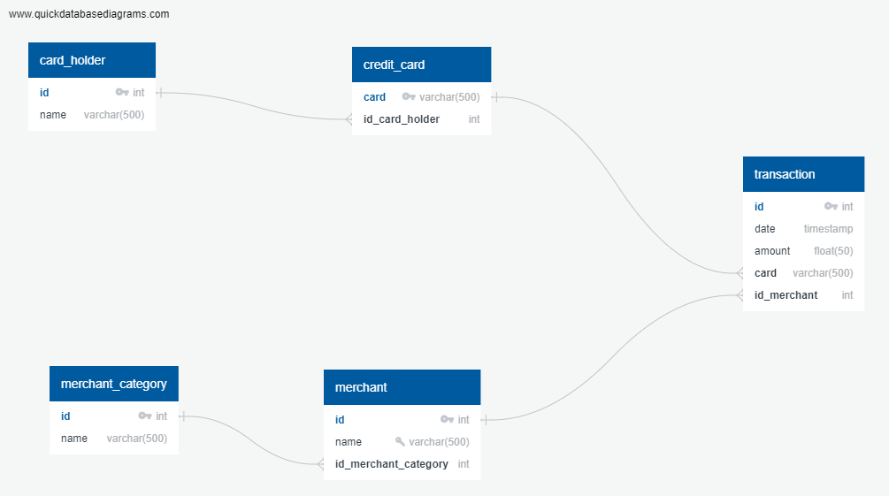

# Module-7 Challenge: credit-card-fraud

# Data Modeling and Engineering

    

You can also see QuickDBD-export.sql for the postgres database schema and table constructions.

# Data Analysis
## Part 1

## Is there any evidence to suggest that a credit card has been hacked? Explain your rationale.
---

From our analysis we see that we have 3500 credit card transactions in our database of which 350 are below $2. That represents 10% of the data and suggests that there may be evidence of credit card fraud in the system.

Please see credit_card_fraud.sql for query's.

 
 

## Take your investigation a step further by considering the time period in which potentially fraudulent transactions are made.
---

The results from our sql query shows that there are only 30 potential fraudulant transaction between 7am-9am. This means than less than 10% of our total possible fraudulant transactions (350) occurs between these times meaning that most of the possible fraudulant transactions (greaten than 90%) occurs during the rest of the day.

Our results also show that the top 5 merchants prone to hacking are:
- Wood-Ramirez
- Hood-Phillip 
- Jarvis-Turner
- Walker Deleon and 
- Wolf and Atkinson Ltd.

Please see credit_card_fraud.sql for query's.

 
 

## Part 2

## What difference do you observe between the consumption patterns? Does the difference suggest a fraudulent transaction? Explain your rationale.

The data suggests that there are indeed large outliers in the dollar amount of certain card transactions. There doesn't seem to be any apparant patern but there is strong evidence to suggest that there is fraudulant activity taking place - please see visual_data_analysis.ipynb for details.

 
 

## Do you notice any anomalies? Describe your observations and conclusions.

We can see that for this Cardholder 25 there was a suspicious transactions in January, March and May. Additionally three were three large transactions (outliers) in Aprl and June - please see visual_data_analysis.ipynb for details.